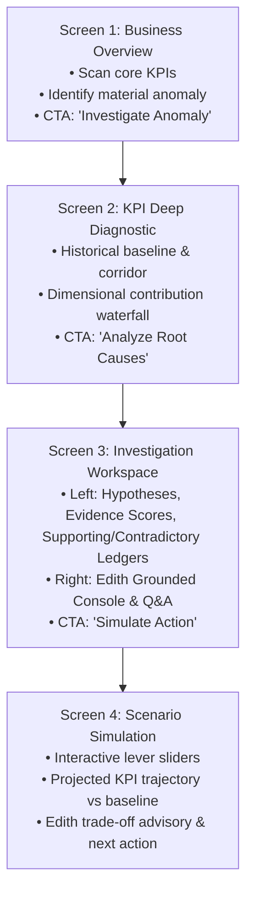
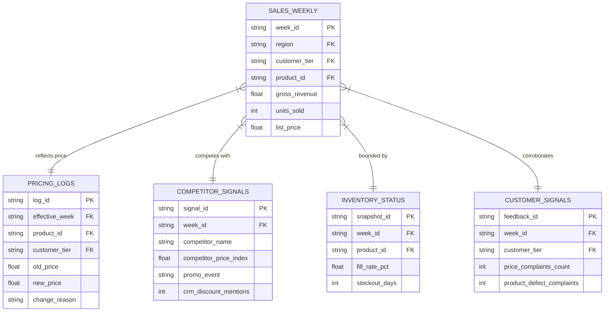

# Implementation Plan: EDITH (AI-Assisted Business Intelligence Investigation System)
**Accenture Innovation Challenge 2026 — Problem Track 3: BusinessIntelligence.ai**

---

## 1. Problem Understanding & Solution Overview

### A. Problem Statement
Traditional enterprise BI dashboards show **what happened** (e.g., *Monthly B2B Sales dropped 14.2% in Region B*), but leave the critical questions—**why did it happen?**, **what evidence supports that?**, and **what should we do next?**—to manual, time-consuming analyst investigations.

Generic AI chatbots and dashboard copilots fail because:
1. They hallucinate numbers and invent causal stories without statistical backing.
2. They cannot evaluate competing explanations or account for conflicting evidence.
3. They jump to single conclusions without quantifying uncertainty or checking temporal order.

### B. Edith's Solution Mechanism
**EDITH** is an evidence-grounded investigation system that guides decision-makers through an explicit 7-stage workflow:

$$\text{OBSERVE} \longrightarrow \text{DETECT} \longrightarrow \text{INVESTIGATE} \longrightarrow \text{EVIDENCE} \longrightarrow \text{EXPLAIN} \longrightarrow \text{SIMULATE} \longrightarrow \text{ACT}$$

Edith is fundamentally **NOT** a chatbot on top of a dashboard. It is an **analytical investigation engine** where:
- A **deterministic analytical layer** processes data, detects statistical anomalies, decomposes variance, tests candidate hypotheses against empirical data, verifies temporal precedence, and computes a composite **Evidence Score**.
- A **downstream LLM reasoning layer (Edith)** explains the structured findings, highlights contradictions, quantifies uncertainty, answers user questions strictly using verified facts, and guides counterfactual what-if simulations.

---

## 2. Epistemological Grounding: Data vs. Assumption vs. Scenario

To avoid over-claiming or confusing synthetic parameters with empirical truths, the system explicitly categorizes all presented information:

```
+----------------------------------------------------------------------------------------------------+
|                                    INFORMATION TAXONOMY IN EDITH                                   |
+------------------------------------+--------------------------------+------------------------------+
| 1. DATA-DERIVED RESULT             | 2. MODEL ASSUMPTION            | 3. SYNTHETIC DEMO SCENARIO   |
| (Empirically computed from data)   | (Explicit parametric rule)     | (Seeded ground-truth context)|
+------------------------------------+--------------------------------+------------------------------+
| • Current KPI value & delta %      | • Elasticity model formulation | • Scenario: B2B Enterprise   |
| • 8-week baseline & expected range |   (\Delta Q / \Delta P)        |   Software Product Line      |
| • Anomaly breach magnitude & Z-score| • Evidence Score weight config | • Simulated events: price    |
| • Dimensional contribution %       | • Anomaly materiality cutoff   |   hike on W06, competitor    |
| • Temporal lag alignment (\tau)    |   (5% drop and persistence)    |   discount on W07            |
| • Difference-in-Differences cohort | • Lead-time causality window   | • Synthetic CRM complaint    |
|   comparison (\Delta Y_A - \Delta Y_C) |   (\tau \in [1, 4] weeks)      |   counts and survey tags     |
+------------------------------------+--------------------------------+------------------------------+
```

---

## 3. Product Workflow & Screen-by-Screen UX (Progressive Disclosure)

The interface is structured as a **focused 4-screen investigation workflow** that progressively reveals depth rather than overwhelming the user with a single giant dashboard.



---

### Screen 1: Business Overview (The "Observe & Detect" Hub)
- **Goal**: Give the user a clear overview of business health, highlight anomalies, and prompt an investigation.
- **What the user sees**:
  - Top bar with global time window selector (`Last 52 Weeks - Current: W08 2026`).
  - 4 clean KPI cards: **Monthly B2B Sales** (*Anomalous*), **Gross Margin %** (*Normal*), **Customer Churn Rate** (*Normal*), **Marketing ROAS** (*Normal*).
  - Each card displays: Current Value, $\Delta\%$ vs previous period, Sparkline with expected corridor, and Status Badge (`Normal` vs `⚠️ Material Anomaly`).
- **Primary CTA**: `Investigate Anomaly` button on the flagged B2B Sales card.
- **What is NOT shown**: Low-level driver tables, multi-turn chat, simulation sliders.

---

### Screen 2: KPI Deep Diagnostic & Contribution Breakdown
- **Goal**: Answer *"What happened and where did it come from?"* before generating hypotheses.
- **What the user sees**:
  - **Historical Trend & Expected Corridor**: 52-week time-series chart showing actual values, rolling 8-week baseline, and shaded $\pm 2\sigma$ confidence bands.
  - **Anomaly Breach Metrics**: Clear summary stating the statistical breach ($Z = -2.64$, $-14.2\%$ drop, $\$170\text{k}$ dollar deviation, 2-week persistence).
  - **Dimensional Contribution Breakdown**: Interactive waterfall/bar chart decomposing the variance across dimensions:
    - *By Region*: Region B accounts for $76\%$ of the drop.
    - *By Customer Tier*: Enterprise segment accounts for $82\%$ of the regional drop.
    - *By Product*: Product Suite Alpha accounts for $88\%$ of the enterprise drop.
- **Primary CTA**: `Launch Investigation Workspace` button $\rightarrow$ carries the localized anomaly context to Screen 3.

---

### Screen 3: Investigation Workspace (The Core Innovation)
- **Goal**: Answer *"Why did it happen, what evidence exists, and what contradicts it?"*
- **Layout**: Clear side-by-side split layout:

```
+------------------------------------------------------+------------------------------------------------------+
|        LEFT PANE: ANALYTICAL EVIDENCE CANVAS         |       RIGHT PANE: EDITH CONVERSATIONAL CONSOLE       |
+------------------------------------------------------+------------------------------------------------------+
| 1. Candidate Hypotheses (Ranked by Evidence Score)   | 1. Edith Executive Diagnosis                         |
|    - [H1: Pricing Pressure]            Score: 0.82   |    (Plain-language synthesis strictly cited from     |
|    - [H2: Competitor Campaign]         Score: 0.64   |     the Left Pane analytical facts)                  |
|    - [H3: Inventory Stockout]          Score: 0.14   |                                                      |
|    - [H4: Organic Demand Decline]      Score: 0.32   | 2. Calibrated Uncertainty Alert                      |
|                                                      |    (Explicitly notes when evidence is incomplete)    |
| 2. Selected Hypothesis Deep-Dive (e.g. H1)           |                                                      |
|    - Temporal Alignment: Shock at t-2, drop at t     | 3. Interactive Dialogue Terminal                     |
|    - Supporting Evidence Ledger (Empirical facts)    |    - Quick Prompts: "Why is inventory ruled out?"    |
|    - Contradictory Evidence Ledger (Caveats/checks)  |      "What evidence supports competitor action?"     |
|    - Difference-in-Differences vs Control Group      |    - Free-form user Q&A grounded in evidence         |
|    - Data Source Lineage & Freshness Chip            |                                                      |
|                                                      | 4. Recommended Action Framework                      |
|                                                      |    Driver -> Controllable Lever -> Target Action     |
+------------------------------------------------------+------------------------------------------------------+
| PRIMARY CTA (Left): [Simulate Lever Adjustments]     | PRIMARY CTA (Right): [Ask / Confirm Findings]        |
+------------------------------------------------------+------------------------------------------------------+
```

- **Interactive Details**:
  - Clicking any hypothesis card on the left immediately updates the deep-dive charts, evidence ledgers, and right-hand Edith briefing.
  - Evidence items explicitly distinguish *Data-Derived Results* (e.g., CRM complaint spikes) from *Model Assumptions*.

---

### Screen 4: Scenario Simulation & Action Workbench
- **Goal**: Answer *"What happens if we change a controllable business lever?"*
- **What the user sees**:
  - **Controllable Lever Controls (Sliders)**:
    - *Price Adjustment*: $\Delta P \in [-15\%, +10\%]$ (e.g., rollback the recent price hike by $-6\%$).
    - *Targeted Marketing / Rebate Budget*: $\Delta M \in [\$0\text{k}, \$50\text{k}]$.
    - *Expedited Inventory Restock*: Toggle/Slider.
  - **Projected KPI Recovery Trajectory**: Interactive Plotly graph comparing:
    1. *Historical Baseline Trend* (Pre-drop trajectory).
    2. *Do-Nothing Trajectory* (Sustained $-14.2\%$ loss).
    3. *Simulated Recovery Curve* (Projected path over the next 8 weeks).
  - **Model Assumptions & Mechanics Box**: Transparent display of model parameters ($\varepsilon_p = -1.65$, marketing responsiveness, expected lag of 2 weeks).
  - **Edith Trade-Off Advisory**: Text explanation explaining trade-offs (*"A 6% price rollback recovers ~74% of lost volume within 3 weeks, but narrows unit gross margin by 1.9%"*).
- **Primary CTA**: `Export Decision Summary` (Generates an auditable, clean text summary of findings, evidence, simulation parameters, and recommended next checks).

---

## 4. Analytical Engine & Evidence Score Methodology

### A. Baseline & Anomaly Detection
1. **Historical Baseline ($\hat{y}_t$)**: Rolling 8-week median with day/week seasonal adjustment:
   $$\hat{y}_t = \text{Median}(y_{t-8}, \dots, y_{t-1}) \times \text{SeasonalityFactor}_t$$
2. **Expected Range ($\text{Band}_t$)**: Robust standard error computed from Interquartile Range ($IQR$):
   $$\hat{\sigma} = 1.349 \times \text{IQR}(\text{residuals})$$
   $$\text{Expected Corridor} = [\hat{y}_t - 2.0 \cdot \hat{\sigma}, \quad \hat{y}_t + 2.0 \cdot \hat{\sigma}]$$
3. **Materiality & Persistence Filter**:
   - An anomaly is flagged **only** if: (1) $Z$-score $> 2.0$, (2) Relative deviation $> 5.0\%$, (3) Magnitude $> \$50,000$, and (4) Breach persists for $\ge 2$ consecutive cycles.

---

### B. Multi-Dimensional Contribution Slicing
For total drop $\Delta Y = Y_t - Y_{t-1}$, each slice $i$ within dimension $D$ contributes:
$$\text{Contribution Share}_i = \frac{y_{i, t} - y_{i, t-1}}{\Delta Y} \times 100\%$$
Identifies the primary epicenter (e.g., *Region B $\rightarrow$ Enterprise Tier $\rightarrow$ Product Suite Alpha*).

---

### C. Interpretable Composite Evidence Score

The **Evidence Score** $S(H_k) \in [0.0, 1.0]$ is explicitly defined as:
> **"An interpretable composite evidence strength score used to rank competing hypotheses based on available empirical data."**
*(It is not a formal probability of causality, but a transparent heuristic ranking index).*

#### Formulation & Configurable Weights
$$S(H_k) = \text{clamp}_{[0.0, 1.0]} \left( w_T \cdot T_k + w_E \cdot E_k + w_C \cdot C_k - w_D \cdot D_k \right) \times Q_k$$

Where weights are centralized and configurable in `config/settings.py` (Default: $w_T = 0.25, w_E = 0.35, w_C = 0.40, w_D = 0.45$):

```
+----------------------------------------------------------------------------------------------------+
|                               EVIDENCE SCORE COMPONENT SPECIFICATION                               |
+--------------------------+-----------+-------------------------------------------------------------+
| Component                | Range     | Analytical Logic & Meaning                                  |
+--------------------------+-----------+-------------------------------------------------------------+
| 1. Temporal Alignment    | [0.0, 1.0]| Checks if driver shock preceded KPI drop:                   |
|    (T_k)                 |           | • T_k = 1.0 if shock occurred 1-3 weeks prior (\tau \in [1,3])|
|                          |           | • T_k = 0.5 if shock occurred simultaneously (\tau = 0)     |
|                          |           | • T_k = 0.0 if shock occurred AFTER KPI drop (invalid)      |
+--------------------------+-----------+-------------------------------------------------------------+
| 2. Effect & Control      | [0.0, 1.0]| Difference-in-Differences vs unaffected control cohort:     |
|    Alignment (E_k)       |           | DiD = (\Delta Y_{affected} - \Delta Y_{control})            |
|                          |           | E_k = min(1.0, |DiD| / TargetDropThreshold)                 |
+--------------------------+-----------+-------------------------------------------------------------+
| 3. Corroborating Signals | [0.0, 1.0]| Proportion of independent data signals supporting the cause |
|    (C_k)                 |           | (e.g., CRM pricing complaint volume, win/loss discount notes|
+--------------------------+-----------+-------------------------------------------------------------+
| 4. Contradictory Penalty | [0.0, 1.0]| Explicit penalty for empirical facts refuting the hypothesis|
|    (D_k)                 |           | (e.g., Inventory availability > 98% during drop -> D = 1.0) |
+--------------------------+-----------+-------------------------------------------------------------+
| 5. Data Quality Factor   | [0.5, 1.0]| Multiplier reflecting data sample size & refresh latency:   |
|    (Q_k)                 |           | Q_k = (1 - 0.2 * StaleFlag) * (1 - 0.3 * SmallSampleFlag)   |
+--------------------------+-----------+-------------------------------------------------------------+
```

---

## 5. Downstream LLM Architecture & Strategy

### A. Strict LLM Boundary & Data Flow

```
+----------------------------------------------------------------------------------------------------+
|                                 STRICT ARCHITECTURAL DATA FLOW                                     |
+----------------------------------------------------------------------------------------------------+
|  [RAW SYNTHETIC ENTERPRISE DATA]                                                                  |
|       │                                                                                            |
|       ▼                                                                                            |
|  [DETERMINISTIC ANALYTICAL ENGINE] (Python / Pandas / NumPy)                                       |
|  • Calculate Baseline, Expected Range, Z-score, Anomaly Flag                                       |
|  • Decompose Dimensional Variance (Region, Tier, Product)                                          |
|  • Evaluate Candidate Hypotheses (Temporal Lag, DiD, Corroboration, Contradiction)                 |
|  • Compute Deterministic Evidence Scores [0.0, 1.0]                                                |
|  • Compute Parametric What-If Simulation Curves                                                    |
|       │                                                                                            |
|       ▼                                                                                            |
|  [STRUCTURED INVESTIGATION STATE (JSON Payload)]                                                   |
|       │                                                                                            |
|       ▼                                                                                            |
|  [EDITH LLM REASONING LAYER]                                                                       |
|  • Ingests JSON Payload                                                                            |
|  • Synthesizes clear, evidence-cited natural language explanations                                 |
|  • Surfaces contradictions and expresses calibrated uncertainty                                    |
|  • Answers user questions strictly grounded in supplied JSON facts                                 |
|  • Refuses / abstains when facts are absent or insufficient                                        |
+----------------------------------------------------------------------------------------------------+
```

### B. LLM Provider Verification & Recommendation

We evaluate the top options based on live demo reliability, latency, structured output, setup simplicity, and zero-risk fallback:

```
+----------------------------------------------------------------------------------------------------+
|                                     LLM SELECTION EVALUATION                                       |
+--------------------+--------------------+--------------------+--------------------+----------------+
| Criterion          | Google Gemini      | OpenAI             | Anthropic          | Local / Mock   |
|                    | 2.5/1.5 Flash      | GPT-4o-mini        | Claude 3.5 Haiku   | Offline Fallback|
+--------------------+--------------------+--------------------+--------------------+----------------+
| Model Identifier   | gemini-2.5-flash   | gpt-4o-mini        | claude-3-5-haiku   | Deterministic  |
| Python Package     | google-genai       | openai             | anthropic          | Built-in (No pkg)|
| Response Latency   | ⚡ 0.8s - 1.5s      | 1.2s - 2.0s        | 1.2s - 2.2s        | ⚡ 0.01s (Instant)|
| Est. Cost / Query  | < $0.0001          | < $0.0002          | < $0.0003          | $0.00          |
| Reliability        | Cloud API          | Cloud API          | Cloud API          | 100% Guaranteed|
+--------------------+--------------------+--------------------+--------------------+----------------+
```

#### Final Recommendation: **Google Gemini (`gemini-2.5-flash` / `gemini-1.5-flash`) via `google-genai` SDK with Pluggable Fallback**
- **Recommended Provider**: Google Gemini API
- **Recommended Model**: `gemini-2.5-flash` (or `gemini-1.5-flash` depending on API key tier)
- **Why**: Fastest sub-second latency, excellent structured grounding, and minimal token cost.
- **Python Package**: `google-genai`
- **Environment Variable**: `GEMINI_API_KEY` (also supports `OPENAI_API_KEY` via an interchangeable gateway).
- **Setup Steps**: User sets `export GEMINI_API_KEY="your-key"` in terminal or enters it in the Streamlit sidebar settings.
- **Offline / Zero-Key Fallback**: The app includes a **Deterministic Offline Reasoner** (`offline_reasoner.py`). If no API key is provided or the network is offline, Edith continues to function seamlessly using deterministic template synthesis directly from the analytical JSON. **The demo will never break during evaluation.**

---

## 6. Coherent Synthetic Dataset Design

The synthetic dataset represents a 52-week enterprise software B2B commercial environment across 5 relational tables:



### The Coherent Business Scenario Embedded:
1. **Normal Baseline (W01–W05)**: Weekly B2B Sales stable at $\approx \$1.2\text{M}$ globally ($\approx \$420\text{k}$ in Region B).
2. **Driver Event 1 (W06)**: Company raises Enterprise Tier price on *Product Suite Alpha* by $+12\%$ in Region B.
3. **Driver Event 2 (W07)**: Competitor *ApexTech* launches a $-15\%$ discount campaign in Region B.
4. **The Anomaly (W08)**: B2B Sales drops by $-14.2\%$ globally ($-28\%$ in Region B Enterprise).
5. **Empirical Evidence Generated**:
   - Pricing complaints spike to 38 in CRM feedback ($C_{\text{price}} = 0.85$).
   - Difference-in-Differences shows unaffected Mid-Market cohort experienced zero sales drop ($E_{\text{price}} = 0.90$).
   - Inventory fill rate was $99.4\%$ ($D_{\text{inventory}} = 1.0 \rightarrow$ refuting stockouts).

---

## 7. Interactive Scenario Simulation Model

The simulation is **completely quantitative and independent of the LLM**.

### Model Formulation
For user adjustments $\Delta P\%$ (Price adjustment) and $\Delta M$ (Marketing/Promotion spend):
$$\hat{Q}_{\text{sim}} = Q_{\text{current}} \times \left( 1 + \varepsilon_p \cdot \Delta P\% \right) \times \left( 1 + \beta_m \cdot \frac{\Delta M}{M_{\text{base}}} \right)$$
$$\text{Projected Revenue} = \hat{Q}_{\text{sim}} \times P_{\text{new}}$$
$$\text{Projected Margin \%} = \frac{\text{Projected Revenue} - (\hat{Q}_{\text{sim}} \times \text{COGS}) - \Delta M}{\text{Projected Revenue}} \times 100\%$$

- **Default Parameters (Documented Model Assumptions)**:
  - $\varepsilon_p = -1.65$ (Price elasticity of demand for Enterprise Tier).
  - $\beta_m = 0.25$ (Marketing response sensitivity).
  - Time lag $\tau = 2$ weeks (Smoothing sigmoid curve for realistic recovery trajectory over 8 weeks).
- **Edith's Role**: Explains the trade-off between volume recovery and margin degradation in clear language.

---

## 8. Proposed Clean Technical Architecture (Streamlit)

```
edith/
├── app.py                         # Streamlit entrypoint & workflow navigation
├── config/
│   ├── settings.py                # Configurable weights, thresholds, API keys
│   └── semantic_contracts.py      # KPI definitions, dimensions, driver catalog
├── data/
│   ├── generator.py               # Coherent synthetic dataset generator
│   └── repository.py              # In-memory data queries & aggregations
├── core/
│   ├── baseline_engine.py         # Rolling baseline, expected range & anomaly detector
│   ├── contribution_engine.py     # Multi-dimensional variance decomposition
│   ├── evidence_engine.py         # Multi-hypothesis tester & Evidence Score calculator
│   └── simulation_engine.py       # Parametric what-if counterfactual model
├── ai/
│   ├── llm_client.py              # Gemini / OpenAI / Offline Reasoner gateway
│   ├── prompts.py                 # Grounded, evidence-cited prompt templates
│   └── offline_reasoner.py        # Deterministic offline synthesis engine
├── state/
│   └── session_state.py           # Typed session state manager across workflow steps
└── ui/
    ├── components/
    │   ├── cards.py               # KPI metric cards & anomaly badges
    │   ├── charts.py              # Plotly interactive charts (Corridor, Waterfall, DiD)
    │   └── chat_pane.py           # Edith split-pane conversation interface
    └── screens/
        ├── s1_overview.py         # Screen 1: Business Overview
        ├── s2_diagnostic.py       # Screen 2: KPI Deep Diagnostic
        ├── s3_workspace.py        # Screen 3: Dual-Pane Investigation Workspace
        └── s4_simulation.py       # Screen 4: Scenario Simulation Workbench
```

---

## 9. Live Judge Demo Script (4 Minutes)

```
+----------------------------------------------------------------------------------------------------+
|                                       LIVE DEMO WALKTHROUGH                                        |
+------+----------------------+----------------------------------------------------------------------+
| Step | Screen               | What Happens & What is Demonstrated                                  |
+------+----------------------+----------------------------------------------------------------------+
| 1    | Screen 1: Overview   | • Show business overview with 4 KPIs.                                |
|      |                      | • Point to flagged P1 Anomaly on 'Monthly B2B Sales' (-14.2%).       |
|      |                      | • Click 'Investigate Anomaly'.                                       |
+------+----------------------+----------------------------------------------------------------------+
| 2    | Screen 2: Diagnostic | • Show 52-week historical trend breaking below the expected band.    |
|      |                      | • Show dimensional waterfall: 76% of drop is localized to Region B  |
|      |                      |   Enterprise customers buying Product Suite Alpha.                   |
|      |                      | • Click 'Analyze Root Causes'.                                       |
+------+----------------------+----------------------------------------------------------------------+
| 3    | Screen 3: Workspace  | • Show 4 ranked hypotheses: Pricing (0.82) vs Competitor (0.64) vs   |
|      |   (Left Pane)        |   Inventory (0.14).                                                  |
|      |                      | • Point out contradictory evidence refuting Inventory (Stock = 99.4%)|
|      |                      | • Show temporal alignment (Price shock occurred 2 weeks before drop).|
+------+----------------------+----------------------------------------------------------------------+
| 4    | Screen 3: Workspace  | • Edith provides an executive narrative citing specific ledger facts.|
|      |   (Right Pane)       | • Ask Edith: "Why did we rule out inventory shortages?"              |
|      |                      | • Edith answers instantly citing warehouse stock rate and latency.   |
|      |                      | • Click 'Simulate Action Impact'.                                    |
+------+----------------------+----------------------------------------------------------------------+
| 5    | Screen 4: Simulation | • Adjust price rollback slider (-6%) and add $15k targeted promo.    |
|      |                      | • Watch simulated recovery curve project 74% revenue rebound.        |
|      |                      | • Edith explains the margin trade-off.                               |
|      |                      | • Click 'Export Decision Summary' to conclude demonstration.         |
+------+----------------------+----------------------------------------------------------------------+
```

---

## 10. Scope Boundaries: MVP vs. Deferred vs. Future Extensions

```
+----------------------------------------------------------------------------------------------------+
|                                      EXPLICIT SCOPE BOUNDARIES                                     |
+------------------------------------+--------------------------------+------------------------------+
| 🟢 MVP (What WILL Be Implemented)  | 🟡 DEFERRED (Not in Prototype) | ⚪ FUTURE EXTENSIONS          |
+------------------------------------+--------------------------------+------------------------------+
| • 4-screen progressive workflow    | • Multi-persona switcher UI    | • Live streaming Kafka/CDC   |
|   (Overview -> Diagnostic ->       |   (VP vs Ops toggles)          |   ingestion pipelines.       |
|   Workspace -> Simulation).        | • Complex RBAC & PII masking   | • Direct write-back ERP      |
| • Deterministic baseline & anomaly |   infrastructure.              |   execution (auto-reorder).  |
|   detection with expected bands.   | • Model ensembles & heavy deep | • Multi-tenant enterprise    |
| • Dimensional variance waterfall   |   causal DAG estimators.       |   SSO / OAuth.               |
|   decomposition.                   | • Complex distributed database | • Real-time automated model  |
| • Multi-hypothesis testing with    |   connectors (SQL/Snowflake).  |   drift & retraining loops.  |
|   interpretable Evidence Scores.   | • Telemetry billing dashboards | • Voice-interactive Edith    |
| • Time-lag & temporal checks.      |   and fine-grained audit logs. |   conversational interface.  |
| • Grounded Edith LLM dialogue with |                                |                              |
|   100% offline fallback reasoner.  |                                |                              |
| • Quantitative what-if simulation  |                                |                              |
|   workbench with recovery curves.  |                                |                              |
| • Coherent synthetic B2B dataset.  |                                |                              |
+------------------------------------+--------------------------------+------------------------------+
```

---

## 11. Key Risks & Mitigations

1. **Risk**: Live demo failure due to LLM API latency, quota limits, or network dropouts.
   - **Mitigation**: Built-in deterministic `OfflineEdithReasoner` that seamlessly activates if no API key is present or if a network error occurs.
2. **Risk**: Hallucinated analytical numbers in LLM responses.
   - **Mitigation**: Strict prompt templating where the LLM is provided only with pre-calculated JSON figures and explicitly forbidden from performing calculations.
3. **Risk**: User confusion over "Causality" claims.
   - **Mitigation**: Prominent UI disclaimers and tooltips distinguishing *Data-Derived Results*, *Model Assumptions*, and *Empirical Correlations*.
